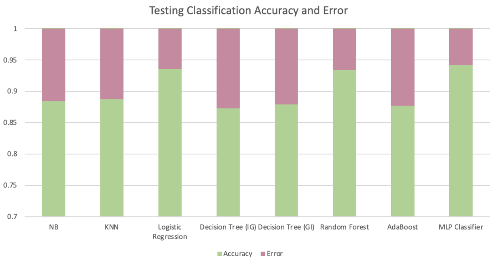
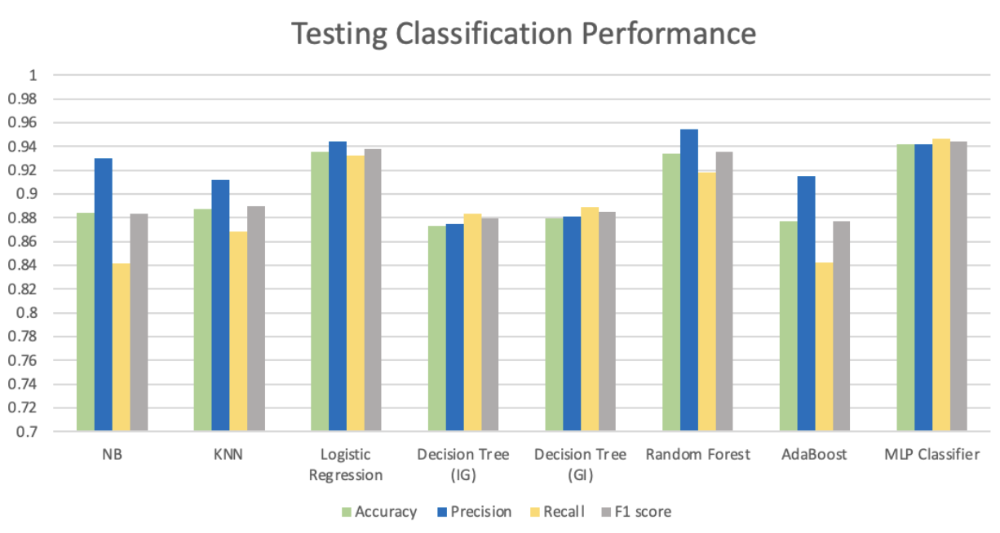

# Fake-Real-News-Classification

<h2> About Project </h2>

The emergence of social media over the last two decades pushed the concept of globalization to an extreme, enabling people to connect with others around the world, express their opinions/beliefs, initiate awareness and social movements, start and develop their businesses, etc. It is becoming increasingly difficult to imagine our daily lives without applications like Facebook, Twitter, Instagram, YouTube, and TikTok. Given the amount of screen time that some of these platforms receive, it is not surprising that many people are becoming increasingly reliant on social media as a prominent source of news and information regarding current events[1]. However, the capacity to reach such a large audience can also be maliciously vectorized for the spread of false information. In recent years, it has become more evident how fake news can be used for swaying public opinion, political polarization, gaining credibility, and drawing consumers’ attention. Fake news is designed to tap into a user’s cognitive biases, raising less suspicion regarding its legitimacy, and oftentimes spreading much quicker than real news[2]. As the general population felt particularly vulnerable during the global outbreak of COVID-19, misinformation pertaining to the disease’s origin, treatment, policies, and prevention infested the internet[3]. Another, even more recent example of extensive use of social media for spreading fake news can be observed in the ongoing Russo-Ukrainian War. The strict censorship of Russian media, leaves the majority of its population blind to the many criminal activities of its government and army[4]. And while some fake news regarding celebrities or pop culture can be relatively harmless, it is incredibly important to equip ourselves with tools for deciphering the truth from the lies in times of a public health crisis or an active geopolitical conflict, where access to the appropriate information can be lifesaving. This project aims to compare various machine learning models in training fake news detection classifiers based on the titles and body texts of various labeled news articles. Previous research into the use of machine learning to distinguish between fake and real news have shown accuracy rates above 90% with Logistic Regression, AdaBoost, and Random Forest [5]. Some natural language processing techniques useful for feature extraction were found to include tokenization, removing stop words, lemmatization, and word weighting[6]. These, along with additional feature extraction methods were employed to generate the models presented in this project.

<h2> Dataset Description </h2>

The dataset of fake and real news was obtained from the ISOT Research Lab at the University of Victoria [7]. To construct the dataset, data was scraped from various news websites and its legitimacy was revealed by Politifact.com, which flags unreliable content. Over 21,000 real news articles were sourced from Reuters.com, and over 24,000 fake news articles were obtained from websites and Wiipedia and those flagged by Politifact.com. The dataset is composed of two csv files, “True.csv” and “Fake.csv”, both of which contain the date of publication, titles of the articles, body texts of articles, and the general subjects of each article. 

<h2> Feature Extraction </h2>

  

- Sentiment Analysis (positive, negative, neutral, and compound) on title and body, separately. 

- TD-IDF on title and body separately

<h2> Trained Classifiers</h2>

  

- Naive Bayes
- KNN (k-value obtained via cross validation)
- Logistic Regression
- Decision Tree
- Random Forest
- AdaBoost 
- Multiple Layer Perception Classifier 

<h2> Results</h2>

 

 

<h2> References </h2>

    

1. Hutchinson, A. (2021). New research shows that 71% of Americans now get news content via social platforms.

2. Buchanan, T. (2020). Why do people spread false information online? the effects of message and viewer characteristics on self-reported likelihood of sharing social media disinformation.PLOS ONE15.

3. Published: Nov 08, 2021 (2021). Covid-19 misinformation is ubiquitous: 78% of the public believes or is unsure about at least one false statement, and nearly a third believe at least four of eight false statements tested.

4. Benjakob, O. (2022). Russia's new disinformation tactic: Fighting 'fake news' with fake news(Haaretz).

5. Ahmad, I., Yousaf, M., Yousaf, S., and Ahmad, M.O. (2020). Fake news detection using machine learning ensemble methods.Complexity2020, 1–11.

6. Probierz, B., Stefański, P., and Kozak, J. (2021). Rapid detection of fake news based on machine learning methods(Elsevier). 

7. Ahmed H, Traore I, Saad S. (2017) “Detection of Online Fake News Using N-Gram Analysis and Machine Learning Techniques. In: Traore I., Woungang I., Awad A. (eds) Intelligent, Secure, and Dependable Systems in Distributed and Cloud Environments. ISDDC 2017. Lecture Notes in Computer Science, vol 10618. Springer, Cham (pp. 127- 138).

